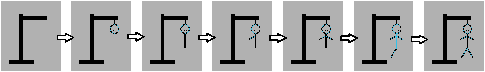
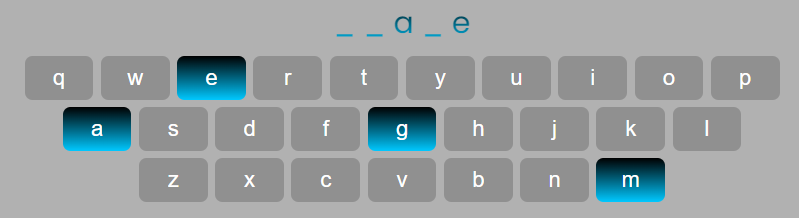
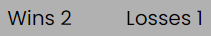
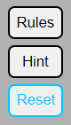

#  **Hangman Game**
Hangman Game is worldwide known game where a player is trying to guess the word letter by letter. If the letter player choses is one of the letters in the word they are trying to guess, that letter is added to it while the others are still hidden. If the player choses the letter that is not in the word they are trying to guess, they get one “mistake” and one part of the hanging stickman is drawn. If player makes six mistakes, they lose the game. 

In this Hangman game, the word that will be hiding behind the underscores is a random animal.

## **Features**
---
 

### Header
* Located at the top of the page
* Clearly tells what the game the player will play
* It is in gradient colors that are in a good contrast with the background
 

 

### Hangman image
* Located below the header
* Changes with each mistake the player makes - adds a body part to a hanging stickmen with each wrong guess
 

    
 

### Play area
* Located below the Hangman image
* Contains the word hidden behind the underscores for a player to guess and the keyboard below it for the player to choose letters from
* Ones the letter (button) is clicked, that letter becomes disabled until the next game
* The answer as well as the disabled letters is the same color gradient as the heading
 

 

### Scores
* Located below the play area
* Shows how many times the player has won the game or run out of guesses and lost the game
* Each time animal is guessed correctly, "Wins" gets incremented by one
* Each time the player run out of possible guesses, "losses" gets incremented by one
 

 

### Top buttons
* Located at the top right corner
* <button>Rules</button> button will present the player the rules of the game
* <button>Hint</button> button will give the player a hint to guess the animal
* <button>Reset</button> button will reset the scores to zero
* When hovered over the buttons, border and text color changes to light blue
 

    
 

### Local storage
* Scores of the game are stored to a local storage
* Key property is set to be the time and date stamp the player started playing
* Value property contains wins and losses counts
