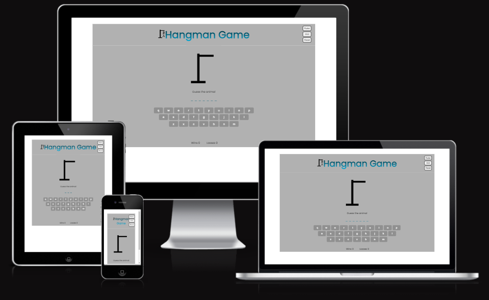
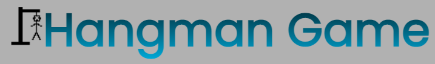
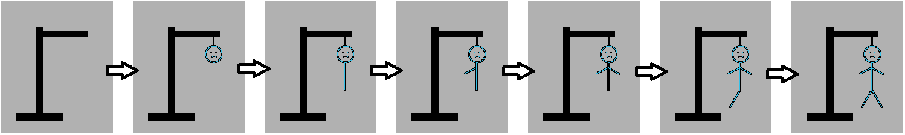
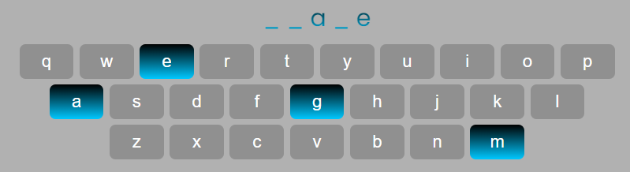
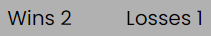
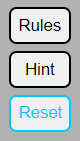
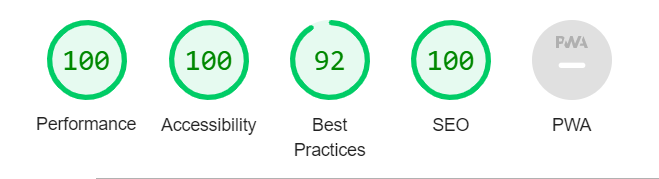
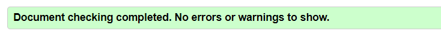
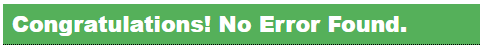
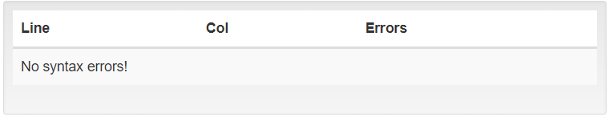

#  **Hangman Game**
Hangman Game is worldwide known game where a player is trying to guess the word letter by letter. If the letter player choses is one of the letters in the word they are trying to guess, that letter is added to it while the others are still hidden. If the player choses the letter that is not in the word they are trying to guess, they get one “mistake” and one part of the hanging stickman is drawn. If player makes six mistakes, they lose the game. 

In this Hangman game, the word that will be hiding behind the underscores is a random animal.

## **Features**
---
 

### Header
* Located at the top of the page
* Clearly tells what the game the player will play
* It is in gradient colors that are in a good contrast with the background
 

 

### Hangman image
* Located below the header
* Changes with each mistake the player makes - adds a body part to a hanging stickmen with each wrong guess
 

    
 

### Play area
* Located below the Hangman image
* Contains the word hidden behind the underscores for a player to guess and the keyboard below it for the player to choose letters from
* Ones the letter (button) is clicked, that letter becomes disabled until the next game
* The answer as well as the disabled letters is the same color gradient as the heading
 

 

### Scores
* Located below the play area
* Shows how many times the player has won the game or run out of guesses and lost the game
* Each time animal is guessed correctly, "Wins" gets incremented by one
* Each time the player run out of possible guesses, "losses" gets incremented by one
 

 

### Top buttons
* Located at the top right corner
* <button>Rules</button> button will present the player the rules of the game
* <button>Hint</button> button will give the player a hint to guess the animal
* <button>Reset</button> button will reset the scores to zero
* When hovered over the buttons, border and text color changes to light blue
 

    
 

### Local storage
* Scores of the game are stored to a local storage
* Key property is set to be the time and date stamp the player started playing
* Value property contains wins and losses counts
 

## **Testing**
---
 

* The game was tested on Chrome, Firefox and Safari browsers and all functions are performing correctly
* I confirm that scores are incremented correctly on the screen as well as in the local storage
* By using the devtools device toolbar, I can confirm that the project looks good on all standard screen sizes
* I can confirm that the colors and font chosen are easy to read and accessible by running it through lighthouse in devtools

 

 

### Validator testing

* HTML
    * No errors were returned when passing through the official W3C Validator

     

    

* CSS
    * No errors were returned when passing through the official (Jigsaw) Validator

     

    

* javascript
    * No errors were returned when passing through the beautifytools javasript validator
    * Reason for not using JSHint validator is explained in “Bugs” section

     

    

 

### Bugs

* Solved bugs
    * When setting up the local storage, month December was presented as number "11" - checked the module 
"Built-in Functions - Working With Date Objects" on the corse and saw that
.getMonth() will generate numbers from 0-11. Fixed it by adding +1 to it.
    * Icon next to the page title did not load - fixed by changed the favicon.ico that was in root document 
with .png image and following code within the head tag `<link rel="shortcut icon" href="assets/images/HangmanGameTitleLogo.png">`
    * javascript validator JSHint was showing me that I have six unused variables, but those were the functions called upon with “onclick” attribute. Couldn’t surpass these warnings in JSHint so I used beautifytools javascript validator where I added `/* jshint esversion:6 */ /* jshint unused:false */` above the javascript code. After that, I got „No syntax errors!“ message.

* Unfixed bugs
    * When testing the game on safari browser on the iphone 11, keyboard buttons are not resized which makes some of them go to the next line. This is only the case on a Safari browser and on a portrait mode. In landscape mode, buttons are presented correctly.

## **Deployment**

* The website was deployed to the GitHub pages. The steps were:
    * In the GitHub repository, I clicked on the settings button
    * Then navigated to the Pages section
    * There, under "Branch" in dropdown selected "main"
    * The page then refreshed and provided the link to the completed website

## **Credits**
* Gradient text and buttons background was taken from [CSS-TRICKS](https://css-tricks.com/snippets/css/gradient-text/)
* Code for keyboard buttons was a mix of code from youtube video by [dcode](https://www.youtube.com/watch?v=N3cq0BHDMOY) and a project [songBird](https://frapplecat.github.io/songbirb/)
* Code for hiding letter of the word behind underscores is from a youtube video by [Simon Suh](https://www.youtube.com/watch?v=dgvyE1sJS3Y)
* overlay for "rules" and "hint" buttons is taken from [w3schools](https://www.w3schools.com/howto/howto_css_overlay.asp)

